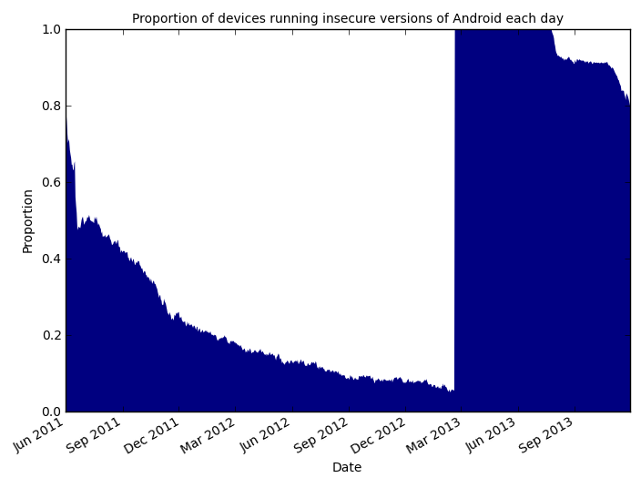

title: Graph
---

 <h2>Proportion of devices running vulnerable versions of Android</h2>
 

This figure shows our estimate of the proportion of Android devices running *insecure*, *maybe secure* and *secure* versions of Android over time.
We label a device as *insecure* if it meets two conditions:
(1) the device is running a version of Android which is vulnerable to at least 1 of the vulnerabilities listed below;
and (2) the device has not received an update which might fix the vulnerability.

Similarly, we label a device as *maybe secure* if the device is running a version of Android which is vulnerable to at least 1 of the vulnerabilities listed below and the device has received an update which might fix the vulnerability.

Finally, we label a device as *secure* if it is running a version of Android which is not vulnerable to any of the vulnerabilities listed below.

We have used data from 21,713 devices taking part in the [Device Analyzer](https://deviceanalyzer.cl.cam.ac.uk/) study.
In particular, we have recorded the Android OS version strings (e.g. "2.3.5") and build strings (e.g. "GRJ22") from each device every day.
We believe data from Device Analyzer provides an optimistic view of Android security because the distribution of supported Android API levels in the Device Analyzer data set demonstrates that Device Analyzer devices are running more recent OS versions than the API distribution levels published by Google for the Google Play app store would suggest is true for the wider Android ecosystem.
It is possible that we provide a pessimistic view.
This would occur if devices running Device Analyzer see many fewer updates than Android devices more generally.

We separate out updates which might represent a [backport](https://en.wikipedia.org/wiki/Backporting) which fixes a vulnerability,  from those updates which cannot fix a vulnerability.
To do so we collect two pieces of information:
(1) the first time we see an OS version string and build string deployed on any device in the Device Analyzer data set;
and (2) the date recorded in the Android Open Source Project (AOSP) when the vulnerability was first fixed (or failing that, the date of discovery of the vulnerability).
If we see an OS version string and build string on any Device Analyzer device before the date of first fix (or discovery) for a vulnerability, we record this as an update which cannot fix that vulnerability; otherwise we record it as an update which might fix that vulnerability.

The vulnerabilities we used to plot the figure, together with the dates when they were first fixed or discovered, are:



