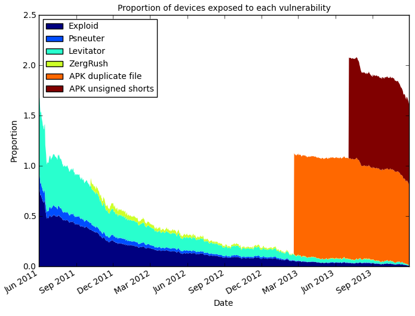

title: Home
menu-position: 0
---

Devices running vulnerable versions of Android

## [List of vulnerabilities](all)
* [by manufacturer](by/manufacturer)
* [by year](by/year)
* [by Android version](by/version)
* [by submitter](by/submitter)

## [Submit a new vulnerability](submit)

## Why?

We are collating all the root equivalent vulnerabilities in Android and storing all the information about them in a machine reable format (json) with references for each fact.
This allows for analysis of what proportion of Android devices are vulnerable to different vulerabilities by using the [Device Analyzer](https://deviceanalyzer.cl.cam.ac.uk/) data.
It should also allow us to compare different manufacturers and network operators in terms of the time it takes them to supply updates to customers.
